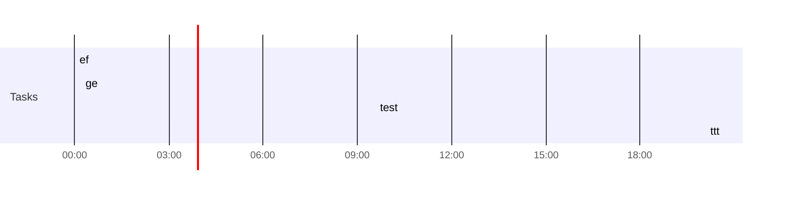

## Day Planner

```mermaid
gantt
    dateFormat  HH-mm
    axisFormat %H:%M
    %% Current Time: 23:45:51
    section Tasks
    ef     :00-00, 11mm
    ge     :00-11, 563mm
    test     :09-34, 631mm
    ttt     :20-05, 0mm
    section Breaks

```

- [ ] 
## hehe

- [x] 00:00 ef
- [x] 00:11 ge
- [x] 09:34 test
- [ ] 20:05 ttt

